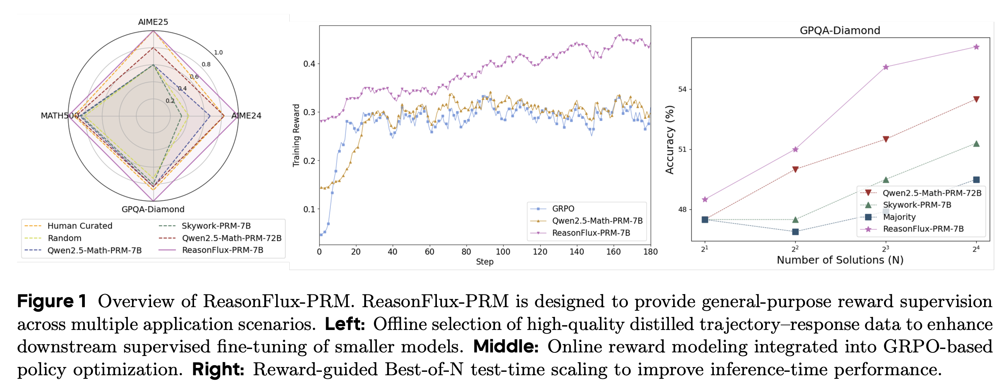
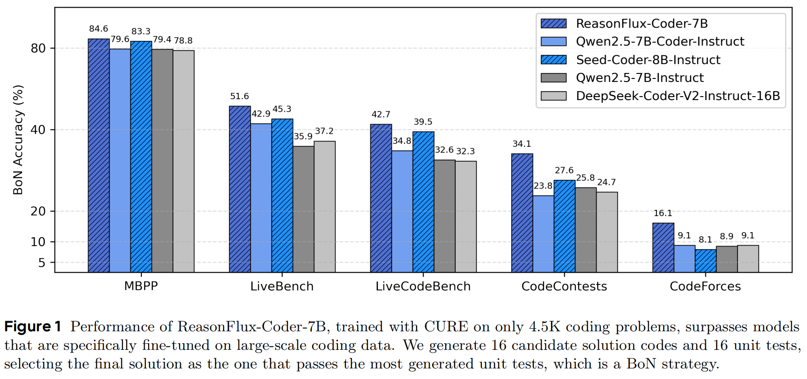
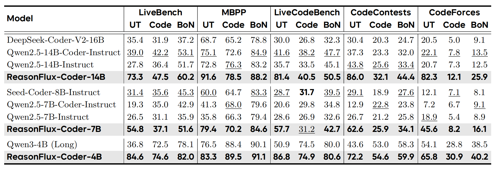
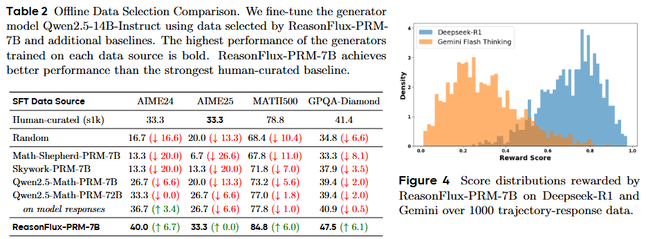
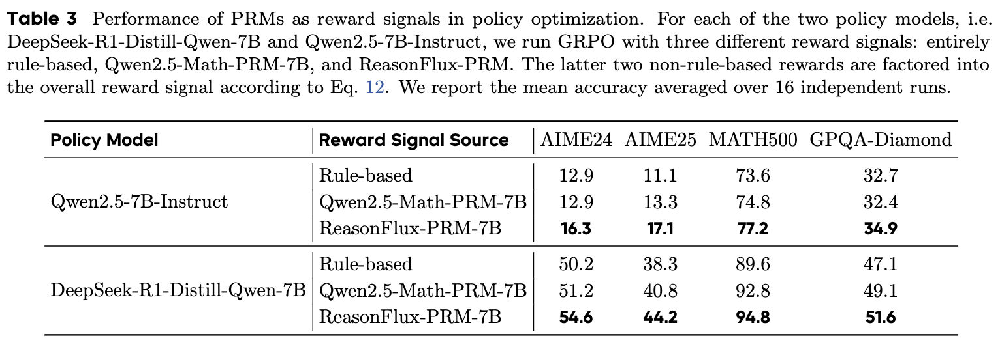
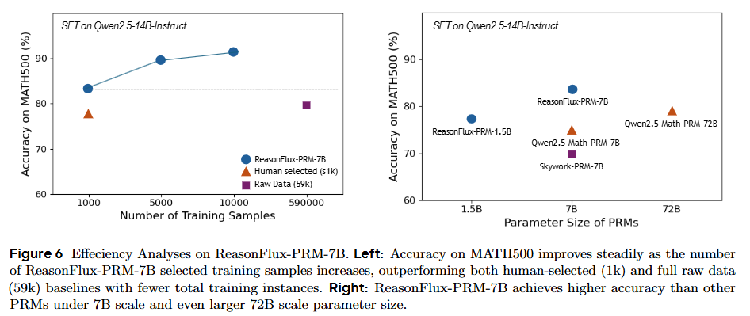

# 🧠 ReasonFlux Series
### *Advanced Open-Source LLM Post-Training Suite*
**Princeton University** \& **PKU** \& **UIUC** \& **University of Chicago** \& **ByteDance TopSeed**

**🎯 Mission**: Building next-generation reasoning capabilities through innovative LLM post-training algorithms focusing on **data selection**, **reinforcement learning**, and **inference scaling**.

## Contents of Repository

- [Updates](#updates)
- [Model Family Guide](#model-family-guide)
  - [ReasonFlux-PRM](./ReasonFlux_PRM/README.md)
  - [ReasonFlux-Coder](https://github.com/Gen-Verse/CURE)
  - [ReasonFlux-v2](./ReasonFlux_v2/README.md)
  - [ReasonFlux-F1](./ReasonFlux_F1/README.md)
  - [ReasonFlux-v1](./ReasonFlux_v1/README.md)
  - [Preliminary Work on Thought Template](#preliminary-work-on-thought-template)
- [Performance Hightlights](#performance-highlights)
- [Citation](#citation)

## 🚀 What Makes ReasonFlux Series Special?

### 1. Long CoT Reasoning with Thought Templates (ReasonFlux V1/F1/V2)
Revolutionary hierarchical reasoning framework that uses thought templates to guide complex problem-solving, achieving SOTA performance with higher efficiency.
<p align="center">

</p>

### 2. Trajectory-Aware Process Reward Models (ReasonFlux-PRM)
Trajectory-aware reward models that provide dense supervision for both offline data selection and online policy optimization.
<p align="center">

</p>

### 3. Co-Evolved RL for LLM Coder and Unit Tester (ReasonFlux-Coder)
Innovative approach where coders and unit testers evolve together through reinforcement learning, creating more robust coding capabilities.
<p align="center">

</p>

## Preliminary Work on Thought Template
Our ReasonFlux-V1/F1/V2 models are built upon insights from our preliminary work on thought templates—specifically, [Buffer of Thoughts](https://arxiv.org/abs/2406.04271) and [SuperCorrect](https://arxiv.org/abs/2410.09008). These works introduce high-level, efficient intermediate reasoning patterns that guide and structure the thinking process of large language models.


## Updates

- [2025/7/3] 🎉 We release the [DPO dataset](https://huggingface.co/datasets/Gen-Verse/ReasonFlux-V2-Reasoner-DPO) for Template Reasoner of [ReasonFlux-V2](./ReasonFlux_v2/README.md).

- [2025/6/23] 🎉 We introduce [**ReasonFlux-PRM**](https://arxiv.org/abs/2506.18896), a family of trajectory-aware process reward models (PRMs) for long CoT reasoning in LLMs. ReasonFlux-PRM is able to support **both offline and online reward supervision**, by selecting high-quality training data for model distillation, providing dense process-level rewards for policy optimization during reinforcement learning, and enabling reward-guided test-time scaling. 
Our trained PRMs including [ReasonFlux-PRM-7B](https://huggingface.co/Gen-Verse/ReasonFlux-PRM-7B) and [ReasonFlux-PRM-1.5B](https://huggingface.co/Gen-Verse/ReasonFlux-PRM-1.5B) are now available on [HuggingFace-GenX](https://huggingface.co/Gen-Verse). We also release a 7B advanced thinking and reasoning model [ReasonFlux-PRM-Qwen-2.5-7B](https://huggingface.co/Gen-Verse/ReasonFlux-PRM-Qwen-2.5-7B) supervised via our PRM.

- [2025/6/04] 🎉 We release our [**Co-Evolving RL**](https://github.com/Gen-Verse/CURE) optimized coding LLMs, [ReasonFlux-Coder-7B](https://huggingface.co/Gen-Verse/ReasonFlux-Coder-7B) and [ReasonFlux-Coder-14B](https://huggingface.co/Gen-Verse/ReasonFlux-Coder-14B), which outperform similarly sized Qwen Coders and DeepSeek Coders, and naturally fit into common test-time scaling and agentic coding pipelines. We also release our Long-CoT model [ReasonFlux-Coder-4B](https://huggingface.co/Gen-Verse/ReasonFlux-Coder-4B), outperforming Qwen3-4B while achieving 64.8% efficiency in unit test generation.
- [2025/5/26] 🎉 We open-source the model weights, training & evaluation scripts for [ReasonFlux-V2](./ReasonFlux_v2/README.md). **We will release our ReasonFlux-V2 paper soon.**
- [2025/5/26] 🎉We release **ReasonFlux-V2-32B**, an effective template-augmented reasoning paradigm including [Template Proposer](https://huggingface.co/Gen-Verse/ReasonFlux-V2-32B-Proposer) and [Template Reasoner](https://huggingface.co/Gen-Verse/ReasonFlux-V2-32B-Reasoner),  which internalizes thought template through iterative hierarchical reinforcement learning. It has achieved SOTA-Level performance with less token consumption.
- [2025/3/24] 🎉We release [ReasonFlux-F1-32B](https://huggingface.co/Gen-Verse/ReasonFlux-F1), [ReasonFlux-F1-14B](https://huggingface.co/Gen-Verse/ReasonFlux-F1-14B), [ReasonFlux-F1-7B](https://huggingface.co/Gen-Verse/ReasonFlux-F1-7B), a series of SOTA-level reasoning LLMs by leveraging the template-augmented reasoning trajectories collected from our ReasonFlux-Zero. For the training and evaluation scripts, please refer to [reasonflux-f1/README.md](./reasonflux-f1/README.md) for detail.
- [2025/2/11] 🎉We release the data, training scripts for SFT stage and demo inference code along with template library of ReasonFlux-v1.
- [2025/2/11]🎉We propose [ReasonFlux-v1](https://arxiv.org/abs/2502.06772), a hierarchical LLM reasoning framework that significantly enhances complex reasoning capabilities, outperforming SOTA models like o1-preview and DeepSeek-V3 on challenging MATH and AIME benchmarks.

## Model Family Guide

### 🧠 **Reasoning Models**

<table>
<tr>
<th>Model</th>
<th>Size</th>
<th>Key Features</th>
<th>Best For</th>
<th>Download</th>
</tr>
<tr>
<td><strong>ReasonFlux-V2</strong></td>
<td>32B</td>
<td>• Template Proposer + Reasoner<br/>• Iterative Hierarchical RL<br/>• SOTA Performance</td>
<td>Complex mathematical reasoning</td>
<td><a href="https://huggingface.co/Gen-Verse/ReasonFlux-V2-32B-Proposer">🤗 Proposer</a><br/><a href="https://huggingface.co/Gen-Verse/ReasonFlux-V2-32B-Reasoner">🤗 Reasoner</a></td>
</tr>
<tr>
<td><strong>ReasonFlux-F1</strong></td>
<td>7B/14B/32B</td>
<td>• Template-augmented trajectories<br/>• Efficient training<br/>• Multiple sizes</td>
<td>General reasoning tasks</td>
<td><a href="https://huggingface.co/collections/Gen-Verse/reasonflux-series-67e8ebd46c7216f5bf8c2421">🤗 Models</a></td>
</tr>
<tr>
<td><strong>ReasonFlux-V1</strong></td>
<td>32B</td>
<td>• Hierarchical reasoning<br/>• Template library<br/>• Foundation model</td>
<td>Research & development</td>
<td><a href="#">🤗 Model</a></td>
</tr>
</table>

### 🎯 **Process Reward Models**

<table>
<tr>
<th>Model</th>
<th>Size</th>
<th>Capabilities</th>
<th>Use Cases</th>
<th>Download</th>
</tr>
<tr>
<td><strong>ReasonFlux-PRM</strong></td>
<td>7B</td>
<td>• Trajectory-aware scoring<br/>• Online/Offline supervision<br/>• Dense process rewards</td>
<td>PRM: Data selection, RL training, Test-time scaling</td>
<td><a href="https://huggingface.co/Gen-Verse/ReasonFlux-PRM-7B">🤗 7B</a></td>
</tr>
<tr>
<td><strong>ReasonFlux-PRM</strong></td>
<td>1.5B</td>
<td>• Lightweight scoring<br/>• Efficient inference<br/>• Edge deployment</td>
<td>PRM: Resource-constrained applications</td>
<td><a href="https://huggingface.co/Gen-Verse/ReasonFlux-PRM-1.5B">🤗 1.5B</a></td>
</tr>
</tr>
<tr>
<td><strong>ReasonFlux-PRM-Qwen-2.5</strong></td>
<td>7B</td>
<td>• Long CoT reasoning <br/>• Solving complex tasks and problems</td>
<td>Tuned Reasoning Model: Math and Science Reasoning</td>
<td><a href="https://huggingface.co/Gen-Verse/ReasonFlux-PRM-Qwen-2.5-7B">🤗 7B</a></td>
</tr>
</table>

### 💻 **Coding Models**

<table>
<tr>
<th>Model</th>
<th>Size</th>
<th>Specialization</th>
<th>Performance</th>
<th>Download</th>
</tr>
<tr>
<td><strong>ReasonFlux-Coder</strong></td>
<td>14B</td>
<td>• Co-evolutionary RL<br/>• Advanced coding<br/>• Unit test generation</td>
<td>Outperforms Qwen & DeepSeek Coders</td>
<td><a href="https://huggingface.co/Gen-Verse/ReasonFlux-Coder-14B">🤗 14B</a></td>
</tr>
<tr>
<td><strong>ReasonFlux-Coder</strong></td>
<td>7B</td>
<td>• Balanced performance<br/>• Efficient inference<br/>• Production ready</td>
<td>Excellent coding capabilities</td>
<td><a href="https://huggingface.co/Gen-Verse/ReasonFlux-Coder-7B">🤗 7B</a></td>
</tr>
<tr>
<td><strong>ReasonFlux-Coder</strong></td>
<td>4B</td>
<td>• Long-CoT reasoning<br/>• Compact size<br/>• Unit test focused</td>
<td>64.8% efficiency in unit test generation</td>
<td><a href="https://huggingface.co/Gen-Verse/ReasonFlux-Coder-4B">🤗 4B</a></td>
</tr>
</table>

## Performance Highlights

### 1. Complex Reasoning

| Model                           | MATH-500 | AIME 2024 | AIME 2025 | GQPA-Diamond |
| ------------------------------- | -------- | --------- | --------- | ------------ |
| **Frontier LLMs**               |          |           |           |              |
| OpenAI-o1-2024-12-17            | 94.8     | 74.3      | 79.2      | –            |
| OpenAI-o3-mini (medium)         | 96.8     | 79.6      | 74.8      | 76.8         |
| Grok3 Beta                      | 96.6     | 83.9      | 77.3      | –            |
| Gemini 2.5-Pro                  | 98.4     | 92.0      | 86.7      | 84.0         |
| **Open-Sourced Reasoning LLMs** |          |           |           |              |
| DeepSeek-R1-Distill-7B          | 83.3     | 55.5      | 23.3      | 49.1         |
| DeepSeek-R1-Distill-14B         | 93.9     | 69.7      | 26.7      | 59.1         |
| DeepSeek-R1-Distill-32B         | 94.3     | 72.6      | 53.3      | 62.1         |
| DeepSeek-R1-Distill-70B         | 94.5     | 70.0      | 56.7      | 65.2         |
| DeepSeek-R1-67B                 | 97.3     | 79.8      | 70.0      | 71.5         |
| QwQ-32B-Preview                 | 90.6     | 50.0      | 46.7      | 65.2         |
| QwQ-32B                         | 97.6     | 80.0      | 63.3      | 68.2        |
| Qwen3-32B                       | 96.6     | 81.4      | 72.9      | 69.2        |
| Qwen3-30B-A3B                   | 96.8     | 80.4      | 70.9      | 65.8         |
| Qwen3-235B-A22B                 | 97.6     | 85.7      | **81.5**  | –            |
| Sky-T1-32B                      | 86.4     | 43.3      | 36.7      | 56.8         |
| LIMO-32B                        | 56.7    | 33.3      | 92.2      | 58.8         |
| s1.1-32B                        | 93.1     | 60.0      | 60.0      | 63.1         |
| OpenThinker-32B                 | 94.8     | 63.3      | 46.7     | 60.1         |
| Light-R1-32B                    | 96.2     | 78.1      | 68.0      | 60.1         |
| **ReasonFlux-V1 (2025-1)**      | 91.2 | 56.7  | 37.2  | 61.2     |
| **ReasonFlux-F1 (2025-3）**     | 96.0 | 76.7  | 53.3  | 67.2     |
| **ReasonFlux-V2 (2025-5)**      | **97.8** | **86.7**  | 76.7  | **71.2**     |


### 2. Code Generation and Reasoning
<p align="center">
  
</p>

### 3. PRMs for Long-CoT Reasoning
We observe that in the downstream offline data selection + SFT setting, ReasonFlux-PRM-7B surpasses the performance of the high-quality, human-curated s1k dataset. We further visualize the score distributions over 1,000 trajectory-response pairs generated by Deepseek-R1 and Gemini. The clearly separated distributions indicate that ReasonFlux-PRM-7B effectively differentiates the quality of responses from different models, offering a robust and reliable reward signal for high-quality data selection.



Under the online settings, ReasonFlux-PRM-7B also surpasses other PRM and rule-based baselines during the GRPO policy optimization. 






## Citation

```bash
@article{yang2025reasonflux,
  title={ReasonFlux: Hierarchical LLM Reasoning via Scaling Thought Templates},
  author={Yang, Ling and Yu, Zhaochen and Cui, Bin and Wang, Mengdi},
  journal={arXiv preprint arXiv:2502.06772},
  year={2025}
}

@article{wang2025reasonfluxcoder,
  title={Co-Evolving LLM Coder and Unit Tester via Reinforcement Learning},
  author={Wang, Yinjie and Yang, Ling and Tian, Ye and Shen, Ke and Wang, Mengdi},
  journal={arXiv preprint arXiv:2506.03136},
  year={2025}
}

@article{zou2025reasonfluxprm,
  title={ReasonFlux-PRM: Trajectory-Aware PRMs for Long Chain-of-Thought Reasoning in LLMs},
  author={Zou, Jiaru and Yang, Ling and Gu, Jingwen and Qiu, Jiahao and Shen, Ke and He, Jingrui and Wang, Mengdi},
  journal={arXiv preprint arXiv:2506.18896},
  year={2025}
}
```
