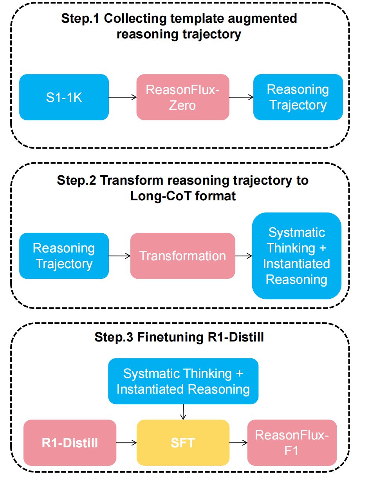

<div align="center">
  <h1>🚀 ReasonFlux</h1>
  <h2>Hierarchical LLM Reasoning via Scaling Thought Templates</h2>
  <p>
    <b>Revolutionary template-augmented reasoning paradigm</b> that empowers a 32B model to outperform o1-mini and DeepSeek-R1 distilled models in reasoning tasks.
  </p>
  
  <p>
    <a href="https://arxiv.org/abs/2502.06772"></a>
    <a href="https://huggingface.co/Gen-Verse/ReasonFlux-F1"></a>
    <a href="https://github.com/Gen-Verse/ReasonFlux/stargazers"></a>
  </p>
</div>

---

## 📊 Performance Highlights

| Task/Pass@1 | [**ReasonFlux-F1-32B**](https://huggingface.co/Gen-Verse/ReasonFlux-F1) | ReasonFlux-Zero-32B | R1-Distill-32B | o1-mini | LIMO-32B | s1-32B |
|:------------|:----------------:|:-------------:|:-------------------:|:-----------------:|:--------:|:--------:|
| MATH500     |      **96.0**    |     91.2      |        94.3        |       90.0        |   90.6   |   93.0   |
| AIME 2024   |      **76.7**    |     56.7      |        72.6        |       56.7        |   50.0   |   56.7   |
| AIME 2025   |      **53.3**    |     37.2      |        46.67       |       50.8        |   37.2   |   49.3   |
| GPQA-Diamond|      **67.2**    |     61.2      |        62.1        |       60.0        |   65.2   |   59.6   |

<div align="center">
  
</div>

---

## 🎯 Quick Start

```bash
# Create and activate environment
conda create -n ReasonFlux python==3.9
conda activate ReasonFlux

# Install dependencies
pip install -r requirements.txt
```

---

## 📚 Table of Contents

- [🌟 Latest Updates](#updates)
- [📥 Dataset Links](#dataset-links)
- [🤖 Model Zoo](#model-zoo)
- [🚀 Getting Started](#getting-started)
  - [🎓 Training](#training)
  - [📊 Evaluation](#evaluation-for-reasonflux-f1)
  - [💡 Inference](#inference)
- [📈 Performance](#performance)
- [✨ Reasoning Example](#reasoning-example)
- [🔬 Preliminary Work](#preliminary-work)
- [📝 Citation](#citation)

---

## 🌟 Latest Updates

### [2025/3/24] 🎉 New Model Release
- [ReasonFlux-F1-32B](https://huggingface.co/Gen-Verse/ReasonFlux-F1)
- [ReasonFlux-F1-14B](https://huggingface.co/Gen-Verse/ReasonFlux-F1-14B)
- [ReasonFlux-F1-7B](https://huggingface.co/Gen-Verse/ReasonFlux-F1-7B)

<div align="center">
  
</div>

### [2025/2/11] 🎉 Initial Release
- Released SFT data
- Training scripts
- Demo inference code
- Template library

---

## 📥 Dataset Links

- **[ReasonFlux-Zero SFT Data](https://huggingface.co/datasets/Gen-Verse/ReasonFlux_SFT_15k)**
- **[ReasonFlux-F1 SFT Data](https://huggingface.co/datasets/Gen-Verse/ReasonFlux-F1-SFT)**

---

## 🤖 Model Zoo

| Model | Download |
|:------|:---------|
| ReasonFlux-F1-32B | [🤗 HuggingFace](https://huggingface.co/Gen-Verse/ReasonFlux-F1) |
| ReasonFlux-F1-14B | [🤗 HuggingFace](https://huggingface.co/Gen-Verse/ReasonFlux-F1-14B) |
| ReasonFlux-F1-7B | [🤗 HuggingFace](https://huggingface.co/Gen-Verse/ReasonFlux-F1-7B) |

---

## 🚀 Getting Started

### 🎓 Training

<details>
<summary>Training ReasonFlux-F1</summary>

1. Add data path to `file_name` field in [dataset_info.json](./LLaMA-Factory/data/dataset_info.json)
2. Run training command:

```bash
llamafactory-cli train \
    --stage sft \
    --do_train True \
    --model_name_or_path deepseek-ai/DeepSeek-R1-Distill-Qwen-32B \
    --preprocessing_num_workers 16 \
    --finetuning_type full \
    --template qwen \
    --flash_attn auto \
    --dataset_dir data \
    --dataset ReasonFlux-F1 \
    --cutoff_len 16384 \
    --learning_rate 1e-05 \
    --num_train_epochs 5.0 \
    --max_samples 100000 \
    --per_device_train_batch_size 1 \
    --gradient_accumulation_steps 2 \
    --lr_scheduler_type cosine \
    --max_grad_norm 1.0 \
    --logging_steps 5 \
    --save_steps 100 \
    --warmup_steps 0 \
    --packing False \
    --report_to none \
    --output_dir saves/DeepSeek-R1-Distill-Qwen-32B/full/ReasonFlux-F1 \
    --bf16 True \
    --plot_loss True \
    --trust_remote_code True \
    --ddp_timeout 180000000 \
    --include_num_input_tokens_seen True \
    --optim adamw_torch \
    --deepspeed cache/ds_z3_offload_config.json
```
</details>

<details>
<summary>Training ReasonFlux-Zero</summary>

1. Add data path to `file_name` field in [dataset_info.json](./LLaMA-Factory/data/dataset_info.json)
2. Run training command:

```bash
llamafactory-cli train \
    --stage sft \
    --do_train True \
    --model_name_or_path Qwen/Qwen2.5-32B-Instruct \
    --preprocessing_num_workers 16 \
    --finetuning_type full \
    --template qwen \
    --flash_attn auto \
    --dataset_dir train/LLaMA-Factory/data \
    --dataset ReasonFlux \
    --cutoff_len 2048 \
    --learning_rate 2e-05 \
    --num_train_epochs 3.0 \
    --max_samples 100000 \
    --per_device_train_batch_size 4 \
    --gradient_accumulation_steps 8 \
    --lr_scheduler_type cosine \
    --max_grad_norm 1.0 \
    --logging_steps 5 \
    --save_steps 100 \
    --warmup_steps 0 \
    --packing False \
    --report_to none \
    --output_dir saves/Qwen2.5-32B-Instruct/full \
    --bf16 True \
    --plot_loss True \
    --trust_remote_code True \
    --ddp_timeout 180000000 \
    --optim adamw_torch \
    --deepspeed cache/ds_z3_offload_config.json
```
</details>

### 📊 Evaluation

```bash
cd reasonflux-f1/eval/lm-evaluation-harness
pip install -e .[math,vllm]

# Evaluate on multiple tasks
OPENAI_API_KEY=your_key_here lm_eval \
    --model vllm \
    --model_args pretrained=Gen-verse/ReasonFlux-F1,dtype=float32,tensor_parallel_size=8,gpu_memory_utilization=0.95 \
    --tasks aime24_figures,aime25_nofigures,openai_math,gpqa_diamond_openai \
    --batch_size auto \
    --apply_chat_template \
    --output_path ReasonFlux-F1 \
    --log_samples \
    --gen_kwargs "max_gen_toks=32768"
```

### 💡 Inference

#### ReasonFlux-F1
```python
from vllm import LLM, SamplingParams
from transformers import AutoTokenizer

model_id = 'Gen-Verse/ReasonFlux-F1'
model = LLM(model_id, tensor_parallel_size=8)
tokenizer = AutoTokenizer.from_pretrained(model_id)

sampling_params = SamplingParams(max_tokens=32768)
question = """Your question here"""
ds_prompt = "REDACTED_SPECIAL_TOKEN\n" + question + "REDACTED_SPECIAL_TOKEN\n"
output = model.generate(ds_prompt, sampling_params=sampling_params)
print(output[0].outputs[0].text)
```

#### ReasonFlux-Zero
```python
from reasonflux import ReasonFlux

reasonflux = ReasonFlux(
    navigator_path='path-to-navigator',
    template_matcher_path='jinaai/jina-embeddings-v3',
    inference_path='path-to-inference-model',
    template_path='template_library.json'
)

problem = """Your problem here"""
```

---

## 📈 Performance

| Model | AIME2024@pass1 | AIME2025@pass1 | MATH500@pass1 | GPQA@pass1 |
|:------|:--------------:|:--------------:|:-------------:|:----------:|
| QwQ-32B-Preview | 46.7 | 37.2 | 90.6 | 65.2 |
| LIMO-32B | 56.3 | 44.5 | 94.8 | 58.1 |
| s1-32B | 56.7 | 49.3 | 93.0 | 59.6 |
| OpenThinker-32B | 66.0 | 53.3 | 94.8 | 60.1 |
| R1-Distill-32B | 70.0 | 46.7 | 92.0 | 59.6 |
| ReasonFlux-Zero-32B | 56.7 | 37.2 | 91.2 | 61.2 |
| **ReasonFlux-F1-32B** | **76.7** | **53.3** | **96.0** | **67.2** |

---

## ✨ Reasoning Example


---

## 🔬 Preliminary Work
Built upon:
- [Buffer of Thoughts](https://github.com/YangLing0818/buffer-of-thought-llm)
- [SuperCorrect](https://github.com/YangLing0818/SuperCorrect-llm)

---

## 📝 Citation

```bibtex
@article{yang2025reasonflux,
  title={ReasonFlux: Hierarchical LLM Reasoning via Scaling Thought Templates},
  author={Yang, Ling and Yu, Zhaochen and Cui, Bin and Wang, Mengdi},
  journal={arXiv preprint arXiv:2502.06772},
  year={2025}
}
```
