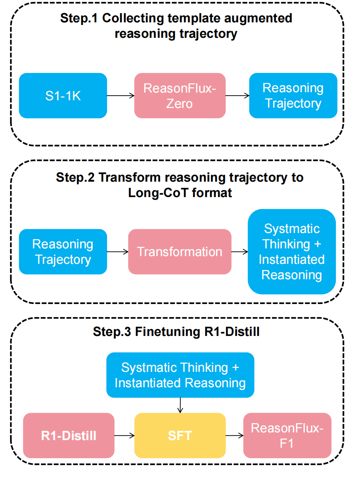

# ReasonFlux-F1

ReasonFlux-F1 is a series of SOTA-level reasoning LLMs finetuned by leveraging the template-augmented reasoning trajectories collected from our ReasonFlux-v1. 

<p align="center">

</p>


## **Performance**

| Task/Pass@1  | [**ReasonFlux-F1-32B**](https://huggingface.co/Gen-Verse/ReasonFlux-F1) | **ReasonFlux-v1-32B** | **R1-Distill-32B** | **o1-mini** | **LIMO -32B** | **s1-32B** |
| :----------- | :----------------------------------------------------------: | :-------------------: | :----------------: | :---------: | :-----------: | :--------: |
| MATH500      |                           **96.0**                           |         91.2          |        94.3        |    90.0     |     90.6      |    93.0    |
| AIME 2024    |                           **76.7**                           |         56.7          |        72.6        |    56.7     |     50.0      |    56.7    |
| AIME 2025    |                           **53.3**                           |         37.2          |       46.67        |    50.8     |     37.2      |    49.3    |
| GPQA-Diamond |                           **67.2**                           |         61.2          |        62.1        |    60.0     |     65.2      |    59.6    |

## Dataset

[🤗 SFT Data of ReasonFlux-F1](https://huggingface.co/datasets/Gen-Verse/ReasonFlux-F1-SFT)

## Model Zoo

|     **Model**     |                         **Download**                         |
| :---------------: | :----------------------------------------------------------: |
| ReasonFlux-F1-32B | [🤗 HuggingFace](https://huggingface.co/Gen-Verse/ReasonFlux-F1) |
| ReasonFlux-F1-14B | [🤗 HuggingFace](https://huggingface.co/Gen-Verse/ReasonFlux-F1-14B) |
| ReasonFlux-F1-7B  | [🤗 HuggingFace](https://huggingface.co/Gen-Verse/ReasonFlux-F1-7B) |

## Getting Started

```bash
conda create -n ReasonFlux_f1 python==3.9
conda activate ReasonFlux_f1
pip install -r requirements.txt
```

## Training

We use fork from [LLaMA-Factory](https://github.com/hiyouga/LLaMA-Factory) to perform training.

To train ReasonFlux-F1, you should follow the steps above:

**Step 1:** Please add the data path to the file_name field of ReasonFlux-F1 entry in [LLaMA-Factory/data/dataset_info.json](./LLaMA-Factory/data/dataset_info.json).

**Step 2:** Run the command below to train ReasonFlux-F1-32B. 

```bash
llamafactory-cli train \
    --stage sft \
    --do_train True \
    --model_name_or_path deepseek-ai/DeepSeek-R1-Distill-Qwen-32B \
    --preprocessing_num_workers 16 \
    --finetuning_type full \
    --template qwen \
    --flash_attn auto \
    --dataset_dir data \
    --dataset ReasonFlux-F1 \
    --cutoff_len 16384 \
    --learning_rate 1e-05 \
    --num_train_epochs 5.0 \
    --max_samples 100000 \
    --per_device_train_batch_size 1 \
    --gradient_accumulation_steps 2 \
    --lr_scheduler_type cosine \
    --max_grad_norm 1.0 \
    --logging_steps 5 \
    --save_steps 100 \
    --warmup_steps 0 \
    --packing False \
    --report_to none \
    --output_dir saves/DeepSeek-R1-Distill-Qwen-32B/full/ReasonFlux-F1 \
    --bf16 True \
    --plot_loss True \
    --trust_remote_code True \
    --ddp_timeout 180000000 \
    --include_num_input_tokens_seen True \
    --optim adamw_torch \
    --deepspeed cache/ds_z3_offload_config.json
```

## Evaluation

We cloned [lm-evaluation-harness](https://github.com/EleutherAI/lm-evaluation-harness) at commit `4cec66e4e468d15789473d6d63c3a61a751fa524` and modified it. Setup:
```bash
cd eval/lm-evaluation-harness
pip install -e .[math,vllm]
```

All commands are in `eval/commands.sh`. For AIME24 we always pick the `aime24_nofigures` result, which uses a dataset that only contains the AIME24 figures if they are important for the task.

For example, to evaluate ReasonFlux-F1-32B on AIME24/25, MATH500 and GPQA-Diamond, you can use the command below:

```bash
OPENAI_API_KEY=Input your openai key here lm_eval --model vllm --model_args pretrained=Gen-verse/ReasonFlux,dtype=float32,tensor_parallel_size=8,gpu_memory_utilization=0.95 --tasks aime24_figures,aime25_nofigures,openai_math,gpqa_diamond_openai --batch_size auto --apply_chat_template --output_path ReasonFlux-F1 --log_samples --gen_kwargs "max_gen_toks=32768"
```

 ### Inference

**ReasonFlux-F1**

```python
from vllm import LLM, SamplingParams
from transformers import AutoTokenizer

model_id = 'Gen-Verse/ReasonFlux-F1'

model = LLM(
    model_id,
    tensor_parallel_size=8,
)
tokenizer = AutoTokenizer.from_pretrained(model_id)

# stop_token_ids = tok("<|im_end|>\n")["input_ids"]

sampling_params = SamplingParams(
    max_tokens=32768,
)
# 2022 AIME I Problems/Problem 15
question = """Let \(x, y\), and \(z\) be positive real numbers satisfying the system of equations:
\[
\begin{array}{c}
\sqrt{2 x-x y}+\sqrt{2 y-x y}=1 \\
\sqrt{2 y-y z}+\sqrt{2 z-y z}=\sqrt{2} \\
\sqrt{2 z-z x}+\sqrt{2 x-z x}=\sqrt{3} .
\end{array}
\]
Then \(\left[(1-x)(1-y)(1-z)\right]^{2}\) can be written as \(\frac{m}{n}\), where \(m\) and \(n\) are relatively prime positive integers. Find \(m+n\)."""
ds_prompt="REDACTED_SPECIAL_TOKEN\n" + question + "REDACTED_SPECIAL_TOKEN\n"
output = model.generate(ds_prompt, sampling_params=sampling_params)
print(output[0].outputs[0].text)

```

## Performance

We present the evaluation results of our ReasonFlux-F1-32B on challenging reasoning tasks including AIME2024,AIM2025,MATH500 and GPQA-Diamond. To make a fair comparison, we report the results of the LLMs on our evaluation scripts in [ReasonFlux-F1](./reasonflux-f1/).

| Model                 | AIME2024@pass1 | AIME2025@pass1 | MATH500@pass1 | GPQA@pass1 |
| --------------------- | :------------: | :------------: | :-----------: | :--------: |
| QwQ-32B-Preview       |      46.7      |      37.2      |     90.6      |    65.2    |
| LIMO-32B              |      56.3      |      44.5      |     94.8      |    58.1    |
| s1-32B                |      56.7      |      49.3      |     93.0      |    59.6    |
| OpenThinker-32B       |      66.0      |      53.3      |     94.8      |    60.1    |
| R1-Distill-32B        |      70.0      |      46.7      |     92.0      |    59.6    |
| ReasonFlux-v1-32B     |      56.7      |      37.2      |     91.2      |    61.2    |
| **ReasonFlux-F1-32B** |    **76.7**    |    **53.3**    |   **96.0**    |  **67.2**  |

## Citation

```bash
@article{yang2025reasonflux,
  title={ReasonFlux: Hierarchical LLM Reasoning via Scaling Thought Templates},
  author={Yang, Ling and Yu, Zhaochen and Cui, Bin and Wang, Mengdi},
  journal={arXiv preprint arXiv:2502.06772},
  year={2025}
}
```