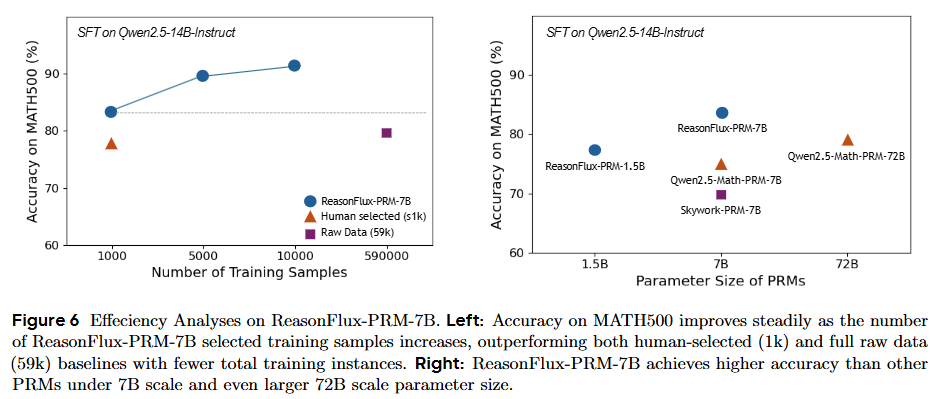

<div align="center">

# ReasonFlux-PRM: Trajectory-Aware PRMs for Long Chain-of-Thought Reasoning in LLMs

</div>

<p align="center">
  <a href="https://arxiv.org/abs/2506.18896">
    
  </a>
  <a href="https://huggingface.co/collections/Gen-Verse/reasonflux-prm-68463c73cf1c6a0ec6fafeb5">
    
  </a>
</p>


## 📖 Introduction


We introduce ReasonFlux-PRM, a trajectory-aware process reward model (PRM) explicitly designed to evaluate the trajectory-response type of reasoning traces. ReasonFlux-PRM incorporates both step-level and trajectory-level supervision, enabling fine-grained reward assignment aligned with structured chain-of-thought data. ReasonFlux-PRM is able to support both offline and online reward supervision, by selecting high-quality training data for model distillation, providing dense process-level rewards for policy optimization during reinforcement learning, and enabling reward-guided test-time scaling. 

## 🔔 News

- **[2025-06-10]** 🤗 Our trained PRMs including [ReasonFlux-PRM-7B](https://huggingface.co/Gen-Verse/ReasonFlux-PRM-7B) and [ReasonFlux-PRM-1.5B](https://huggingface.co/Gen-Verse/ReasonFlux-PRM-1.5B) are now available on [HuggingFace-GenX](https://huggingface.co/Gen-Verse). We also release a 7B advanced thinking and reasoning model [ReasonFlux-PRM-Qwen-2.5-7B](https://huggingface.co/Gen-Verse/ReasonFlux-PRM-Qwen-2.5-7B) supervised via our ReasonFlux-PRM-7B.
- **[2025-06-10]** 🔥 We have released our paper and code.


## ✨ In-Depth Analysis of Existing PRMs 


We observe that **existing PRMs show limited ability to distinguish reasoning traces distilled from different oracle models and often fail to clearly separate high- and low-quality trajectories.**


If we directly apply these PRMs to help select high quality thinking trajectoies and model responses for downstream SFT during model distillation, **they are not well-calibrated for selecting high-quality reasoning trajectories and may degrade generator performance during downstream supervised fine-tuning.** 

Through further experiments and anslyses detailed in the paper, we found that **models' thinking trajectories instinctively differ from final model responses, and existing PRMs are more accustomed to scoring final outputs than intermediate reasoning steps.**

Motivated by the above observation, we desing a new PRM called ReasonFlux-PRM specifically for the "Trajectory-Response" data which is common outputed format of current large reasoning models (e.g., Deepseek-R1).

## 🚀 Getting Started

```bash
git clone https://github.com/Gen-Verse/ReasonFlux.git
cd ReasonFlux_PRM

conda create --name reasonflux-prm python=3.12
conda activate reasonflux-prm

pip install -r requirements.txt
```

## ⚙️ Model Usage
We show how to utilize ReasonFlux-PRM-1.5B, ReasonFlux-PRM-7B for scoring and ReasonFlux-PRM-Qwen-2.5-7B for inference. 

- Prepare the question and corresponding answer.
- Split the answer into different reasoning steps.
- Follow the example below to call ReasonFlux-PRM and receive the process rewards.

*Note: Below, we also provide an example usage for a downstream reasoning model trained via ReasonFlux-PRM.*

**ReasonFlux-PRM-7B**
```python 
import torch
import torch.nn.functional as F
from transformers import AutoModel, AutoTokenizer
from utils.rm_utils import make_step_rewards

# Load ReasonFlux PRM model and tokenizer
model = AutoModel.from_pretrained("Gen-Verse/ReasonFlux-PRM-7B", device_map="auto", torch_dtype=torch.bfloat16, trust_remote_code=True).eval()

tokenizer = AutoTokenizer.from_pretrained("Gen-Verse/ReasonFlux-PRM-7B", trust_remote_code=True)


# Define your question (problem) and reasoning steps (completion)
# Note: You can split the entire answer with `\n\n` to obtain each step
problem = "..."
completion = [
  "...",
  "...",
]

messages = [
  {"role": "user", "content": problem},
  {"role": "assistant", "content": "<extra_0>".join(completion) + "<extra_0>"}, # Join reasoning steps with <extra_0> separator
]

conversation_str = tokenizer.apply_chat_template(
    messages, 
    tokenize=False, 
    add_generation_prompt=False
)

input_ids = tokenizer.encode(
    conversation_str, 
    return_tensors="pt", 
).to(model.device)

with torch.inference_mode():
    outputs = model(input_ids=input_ids)

step_sep_id = tokenizer.encode("<extra_0>")[0]
token_masks = (input_ids == step_sep_id)

# Output your step-level process rewards
step_reward = make_step_rewards(outputs[0], token_masks)

print(step_reward[0])
```


**ReasonFlux-PRM-1.5B**

```python 
import torch 
from utils.rm_utils import RewardModel
from transformers import AutoTokenizer, AutoModelForCausalLM

model = RewardModel.from_pretrained("Gen-Verse/ReasonFlux-PRM-1.5B", auth_token=YOUR_HF_TOKEN)
tokenizer = AutoTokenizer.from_pretrained("Gen-Verse/ReasonFlux-PRM-1.5B", trust_remote_code=True)

problem = "..."
completion = "..."

encoded = tokenizer(
    problem+completion,
    return_tensors="pt",
    padding=True,
    truncation=True,
    max_length=2048,
)

input_ids = encoded["input_ids"].to(model.base_model.device)
attention_mask = encoded["attention_mask"].to(model.base_model.device)
reward = model(input_ids, attention_mask)

print(reward.item())
```

**ReasonFlux-PRM-Qwen-2.5-7B**

```python
import torch
from transformers import AutoModel, AutoModelForCausalLM, AutoTokenizer

device = torch.device("cuda" if torch.cuda.is_available() else "cpu")

tokenizer = AutoTokenizer.from_pretrained("Gen-Verse/ReasonFlux-PRM-Qwen-2.5-7B")
tokenizer.pad_token = tokenizer.eos_token
tokenizer.padding_side = 'left'

model = AutoModelForCausalLM.from_pretrained("Gen-Verse/ReasonFlux-PRM-Qwen-2.5-7B").to(device).eval()

system_message = "Please reason step by step, and put your final answer in \\boxed{}."

problem = "..."

prompt = [{'role': 'system', 'content': system_message},
        {'role': 'user', 'content': problem}]

input_ids = tokenizer.apply_chat_template(prompt, add_generation_prompt=True, return_tensors="pt").to(device)

output = model.generate(
    input_ids, 
    max_new_tokens=4096, 
    num_return_sequences=1,
)
text = tokenizer.decode(output[0], skip_special_tokens=True)

print(text)
```


## 🌱 Downstream Application
After introducing the utilization of ReasonFlux-PRM, we provide an instruction and examples of how to apply ReasonFlux-PRM in downstream applications.

### Set up

The installation and environment setup is similar to VERL. We recommend using conda to manage the environment:

```
conda create -n downstream python==3.10
conda activate downstream
bash scripts/install_vllm_sglang_mcore.sh
pip install --no-deps -e .
```

### Training
We provide code for online policy optimization with ReasonFlux as a reward signal during GRPO training. Our implementation of GRPO is largly built on the [VERL](https://github.com/volcengine/verl) repository. 

```
cd Application
```

To generate the training data parquets, run the following command:

```
python3 examples/data_preprocess/dapo_multiturn_w_tool.py --local_dir ~/data/dapo
```

We provide example training scripts in the `Application/examples/grpo_trainer` repository. 

To run GRPO training with rule-based reward on the `Qwen2.5-7B-Instruct` policy model, run

```
bash examples/grpo_trainer/qwen_rulebased_dapo.sh
```

To run GRPO training with ResonFlux-PRM rewards on the `Qwen2.5-7B-Instruct` policy model, run

```
bash examples/grpo_trainer/qwen_reasonflux_dapo.sh
```


## 📊 Results


We observe that in the downstream offline data selection + SFT setting, ReasonFlux-PRM-7B surpasses the performance of the high-quality, human-curated s1k dataset. We further visualize the score distributions over 1,000 trajectory-response pairs generated by Deepseek-R1 and Gemini. The clearly separated distributions indicate that ReasonFlux-PRM-7B effectively differentiates the quality of responses from different models, offering a robust and reliable reward signal for high-quality data selection.


Under the online settings, ReasonFlux-PRM-7B also surpasses other PRM and rule-based baselines during the GRPO policy optimization. 


We also conduct effeciency analysis on ReasonFlux-PRM. For additional experiments, please refer to our paper.


## 💬 Discussion
Please do not hesitate to contact us if you have any questions or want to discuss our research further!

**Contact:** jiaruz2@illinois.edu, yangling0818@163.com 

## 📝 Citation

If you find this work helpful, please kindly cite our paper:

```bash
@article{zou2025reasonfluxprm,
  title={ReasonFlux-PRM: Trajectory-Aware PRMs for Long Chain-of-Thought Reasoning in LLMs},
  author={Zou, Jiaru and Yang, Ling and Gu, Jingwen and Qiu, Jiahao and Shen, Ke and He, Jingrui and Wang, Mengdi},
  journal={arXiv preprint arXiv:2506.18896},
  year={2025}
}
```
