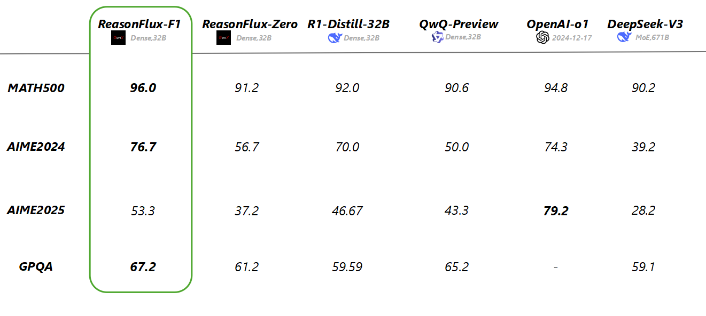
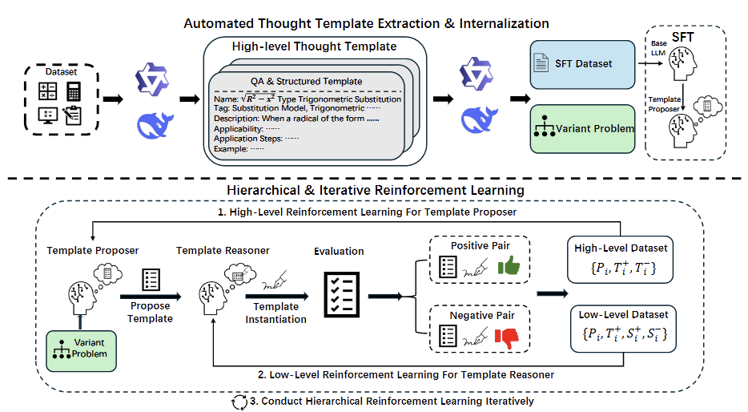
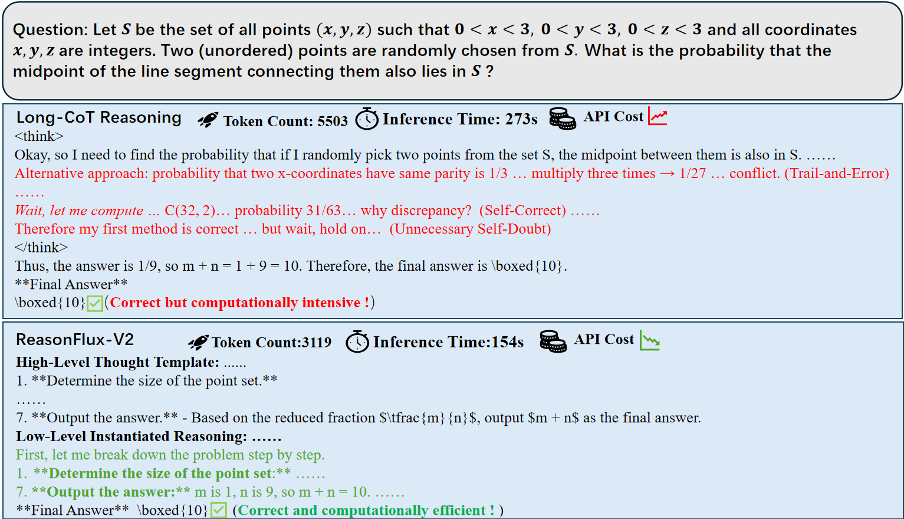

<div align="center">
  <h1>ReasonFlux-V2:Internalizing Template-Augmented LLM Reasoning
with Hierarchical Reinforcement Learning</h1>
</div>

<p align="center">

</p>

# Introduction

**ReasonFlux-V2** is our new template-augmented reasoning paradigm which **internalize the thought templates** through **iterative hierarchical reinforcement learning**.  Specifically, we first develop an automated pipeline to extract thought templates from the problem–solution pairs in training set. To effectively internalize these high-level thought templates and learning a more efficient reasoning paradigm,  we propose two collaborative modules: **Template Proposer**  which adaptively proposes suitable thought templates based on the input problem; and **Template Reasoner **,which exactly instantiates the proposed templates and performs precise, detailed reasoning. Building upon these modules, we iteratively conduct **hierarchical RL** on optimizing both modules. 

<p align="center">

</p>
**ReasonFlux-v2** offers a more efficient, generalizable solution for enhancing the complex reasoning capabilities of LLMs. Compare with conventional reasoning LLMs, our **ReasonFlux-V2** could correctly and efficiently solve the problems with less token consumption and inference time. 

 **We will release our paper related with ReasonFlux-V2 soon.**

## Overview & Examples

ReasonFlux-v2 consists of two main modules:

1. **Template Proposer**, which **adaptively** proposes suitable high-level thought templates based on the input problem. It functions as intuitive thinking process of human which helps to **narrow the exploration space** of detailed reasoning process thus **improve the solution efficiency**.
2. **Template Reasoner**, which follow the proposed high-level thought template to efficiently and effectively solve the corresponding problem.

<p align="center">

</p>

## ✅ TODO
- [ ] Release  the code for data construction process for each stage.
- [ ] Release the data for each stage and release the model checkpoint for iterative round 3.
- [ ] Release the code for evaluation on GPQA-Diamond

### 🤗 Model Pool & Dataset

|          **Model**           |                         **Download**                         |
| :--------------------------: | :----------------------------------------------------------: |
| ReasonFlux-V2-32B（Round 1） | [🤗 HuggingFace](https://huggingface.co/Gen-Verse/ReasonFlux-V2-32B) |

|               **Dataset**               |                         **Download**                         |
| :-------------------------------------: | :----------------------------------------------------------: |
|       Extracted Thought Template        | [🤗 HuggingFace](https://huggingface.co/Gen-Verse/ReasonFlux-V2-Template) |
|               SFT Dataset               | [🤗 HuggingFace](https://huggingface.co/Gen-Verse/ReasonFlux-V2-SFT) |
| Template Proposer DPO Dataset (Round 1) | [🤗 HuggingFace](https://huggingface.co/Gen-Verse/ReasonFlux-V2-DPO) |
| Template Reasoner DPO Dataset (Round 1) |                   Will soon be available !                   |

## ⚙️ Quick Start
First, set up the enviroment:
```
pip install -r requirements.txt
```

And make sure install the latest version of [sglang](https://github.com/sgl-project/sglang)

```bash
pip install "sglang[all]>=0.4.6.post1"
```

For training, we utilize open-source framework [LLaMA-Factory](https://github.com/hiyouga/LLaMA-Factory), run the code below to install the latest version

```bash
git clone --depth 1 https://github.com/hiyouga/LLaMA-Factory.git
cd LLaMA-Factory
pip install -e ".[torch,metrics]" --no-build-isolation
```

## 🔧 Training

Add the path of the downloaded dataset to data_info.json in LLaMA-Factory.

For SFT, run the code below:

```bash
llamafactory-cli train \
    --stage sft \
    --do_train True \
    --model_name_or_path Qwen/Qwen3-32B \
    --preprocessing_num_workers 16 \
    --finetuning_type full \
    --template qwen3 \
    --flash_attn auto \
    --dataset_dir data \
    --dataset ReasonFlux-v2-sft \
    --cutoff_len 16384 \
    --learning_rate 1e-05 \
    --num_train_epochs 5.0 \
    --max_samples 100000 \
    --per_device_train_batch_size 4 \
    --gradient_accumulation_steps 8 \
    --lr_scheduler_type cosine \
    --max_grad_norm 1.0 \
    --logging_steps 5 \
    --save_steps 100 \
    --warmup_steps 0 \
    --packing False \
    --report_to none \
    --output_dir saves/Qwen3-32B/full/Template-Proposer-sft \
    --bf16 True \
    --plot_loss True \
    --trust_remote_code True \
    --ddp_timeout 180000000 \
    --include_num_input_tokens_seen True \
    --optim adamw_torch \
    --deepspeed cache/ds_z3_offload_config.json
```

For DPO of **template proposer**, run the code below:

```bash
llamafactory-cli train \
    --stage dpo \
    --do_train True \
    --model_name_or_path saves/Qwen3-32B/full/Template-Proposer-sft\
    --preprocessing_num_workers 16 \
    --finetuning_type full \
    --template qwen3 \
    --flash_attn auto \
    --dataset_dir data \
    --dataset dpo_proposer \
    --cutoff_len 16384 \
    --learning_rate 5e-07 \
    --num_train_epochs 4.0 \
    --max_samples 100000 \
    --per_device_train_batch_size 4 \
    --gradient_accumulation_steps 8 \
    --lr_scheduler_type cosine \
    --max_grad_norm 1.0 \
    --logging_steps 5 \
    --save_steps 100 \
    --warmup_steps 0 \
    --packing False \
    --report_to none \
    --output_dir saves/Qwen3-32B/full/Template-Proposer-DPO \
    --bf16 True \
    --plot_loss True \
    --trust_remote_code True \
    --ddp_timeout 180000000 \
    --include_num_input_tokens_seen True \
    --optim adamw_torch \
    --pref_beta 0.5 \
    --pref_ftx 0 \
    --pref_loss sigmoid \
    --deepspeed cache/ds_z3_offload_config.json
```

For DPO of **template reasoner**, run the code below:

```bash
llamafactory-cli train \
    --stage dpo \
    --do_train True \
    --model_name_or_path /data_storage/yzc/models/Qwen/Qwen3-32B \
    --preprocessing_num_workers 16 \
    --finetuning_type full \
    --template qwen3 \
    --flash_attn auto \
    --dataset_dir data \
    --dataset dpo_reasoner \
    --cutoff_len 16384 \
    --learning_rate 5e-07 \
    --num_train_epochs 1.0 \
    --max_samples 100000 \
    --per_device_train_batch_size 4 \
    --gradient_accumulation_steps 8 \
    --lr_scheduler_type cosine \
    --max_grad_norm 1.0 \
    --logging_steps 5 \
    --save_steps 100 \
    --warmup_steps 0 \
    --packing False \
    --report_to none \
    --output_dir saves/Qwen3-32B/full/Template-Reasoner-DPO \
    --bf16 True \
    --plot_loss True \
    --trust_remote_code True \
    --ddp_timeout 180000000 \
    --include_num_input_tokens_seen True \
    --optim adamw_torch \
    --pref_beta 0.5 \
    --pref_ftx 0 \
    --pref_loss sigmoid \
    --deepspeed cache/ds_z3_offload_config.json
```

## Evaluation

The running of the evaluation scripts requires two distinct models, so first we utilize sglang to to create an OpenAI-compatible API endpoint for more efficient sampling.

To deploy Template Proposer, run:

```bash
CUDA_VISIBLE_DEVICES=0,1,2,3 python -m sglang.launch_server --model-path GenVerse/ReasonFlux-V2-Proposer-32B --reasoning-parser qwen3 --port 30000 --tp-size 4
```

To deploy Template Reasoner, run:

```bash
CUDA_VISIBLE_DEVICES=0,1,2,3 python -m sglang.launch_server --model-path GenVerse/ReasonFlux-V2-Proposer-32B --reasoning-parser qwen3 --port 30001 --tp-size 4
```

 Then run the code below to continue the evaluation on the benchmark:

```bash
python extract_solve_eval.py -b AIME24,AIME25,MATH500 -tm Template-Proposer-32B -rm Template-Reasoner-32B 
```

## Performance

Her we compare our ReasonFlux series models with **Frontier LLMs** and other **Open-Sourced Reasoning LLMs** on challenging benchmarks like MATH-500,AIME2024,AIME-2025 and GPQA-Diamond. We can see that our method has achieved state-of-the-art performance on all evaluated tasks.

| Model                           | MATH-500 | AIME 2024 | AIME 2025 | GQPA-Diamond |
| ------------------------------- | -------- | --------- | --------- | ------------ |
| **Frontier LLMs**               |          |           |           |              |
| OpenAI-o1-2024-12-17            | 94.8     | 74.3      | 79.2      | –            |
| OpenAI-o3-mini (medium)         | 96.8     | 79.6      | 74.8      | 76.8         |
| Grok3 Beta                      | 96.6     | 83.9      | 77.3      | –            |
| Gemini 2.5-Pro                  | 98.4     | 92.0      | 86.7      | 84.0         |
| **Open-Sourced Reasoning LLMs** |          |           |           |              |
| DeepSeek-R1-Distill-7B          | 83.3     | 55.5      | 23.3      | 49.1         |
| DeepSeek-R1-Distill-14B         | 93.9     | 69.7      | 26.7      | 59.1         |
| DeepSeek-R1-Distill-32B         | 94.3     | 72.6      | 53.3      | 62.1         |
| DeepSeek-R1-Distill-70B         | 94.5     | 70.0      | 56.7      | 65.2         |
| DeepSeek-R1-67B                 | 97.3     | 79.8      | 70.0      | 71.5         |
| QwQ-32B-Preview                 | 90.6     | 50.0      | 46.7      | 65.2         |
| QwQ-32B                         | 97.6     | 80.0      | 63.3      | 68.18        |
| Qwen3-32B                       | 96.6     | 81.4      | 72.9      | 69.19        |
| Qwen3-30B-A3B                   | 96.8     | 80.4      | 70.9      | 65.8         |
| Qwen3-235B-A22B                 | 97.6     | 85.7      | **81.5**  | –            |
| Sky-T1-32B                      | 86.4     | 43.3      | 36.7      | 56.8         |
| LIMO-32B                        | 56.67    | 33.3      | 92.2      | 58.8         |
| s1.1-32B                        | 93.1     | 60.0      | 60.0      | 63.1         |
| OpenThinker-32B                 | 94.8     | 63.3      | 46.67     | 60.1         |
| Light-R1-32B                    | 96.2     | 78.1      | 68.0      | 60.1         |
| **ReasonFlux-V1 (2025-1)**      | **91.2** | **56.7**  | **37.2**  | **61.2**     |
| **ReasonFlux-F1 (2025-3）**     | **96.0** | **76.7**  | **53.3**  | **67.2**     |
| **ReasonFlux-V2 (2025-5)**      | **97.8** | **86.7**  | **76.7**  | **71.2**     |

## 📖 Citation

```bash
@article{yang2025reasonflux_v1,
  title={ReasonFlux: Hierarchical LLM Reasoning via Scaling Thought Templates},
  author={Yang, Ling and Yu, Zhaochen and Cui, Bin and Wang, Mengdi},
  journal={arXiv preprint arXiv:2502.06772},
  year={2025}
}
```

